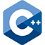

### About Me :

I am a Full Stack Developer  from Pakistan.

- 🔭 I’m working as a Software Engineer and contributing to frontend and backend for building web applications.
- 🌱 Exploring New Technologies.
- 📫 How to reach me:   

---

### 🔥   My Stats :

  

<!-- 

 -->

---

### 🛠 &nbsp;Languages and Tools :

---

<h3>Links</h3>

---

<!--
**NoumanShah042/NoumanShah042** is a ✨ _special_ ✨ repository because its `README.md` (this file) appears on your GitHub profile.

Here are some ideas to get you started:

- 🔭 I’m currently working on ...
- 🌱 I’m currently learning ...
- 👯 I’m looking to collaborate on ...
- 🤔 I’m looking for help with ...
- 💬 Ask me about ...
- 📫 How to reach me: ...
- 😄 Pronouns: ...
- ⚡ Fun fact: ...

find icons here: https://github.com/tandpfun/skill-icons?tab=readme-ov-file
-->
